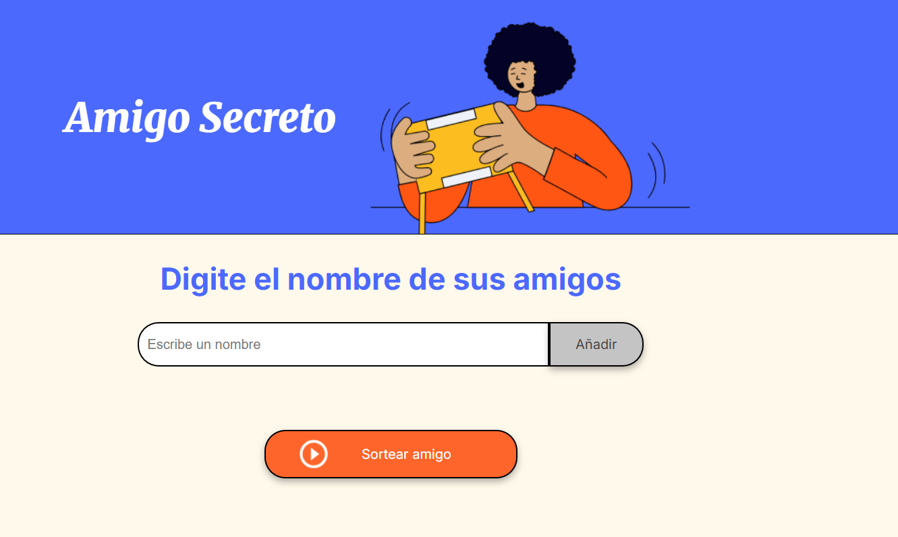

# Challenge - Amigo Secreto

Este desafío consiste en una aplicación que permite a los usuarios ingresar nombres de amigos en una lista, realizar un sorteo aleatorio y determinar quién es el "Amigo Secreto". Los usuarios pueden agregar nombres a través de un campo de texto y un botón "Añadir", visualizar la lista y, finalmente, hacer clic en "Sortear Amigo" para seleccionar un nombre aleatorio, mostrando el resultado en pantalla.

## Funcionalidades
**Agregar nombres:** Los usuarios pueden ingresar nombres en un campo de texto y hacer clic en **"Añadir"** para agregarlos a la lista.

 

**Validación de entrada:** Si el campo de texto está vacío o contiene caracteres no válidos, el sistema mostrará una alerta solicitando un nombre válido.

 

